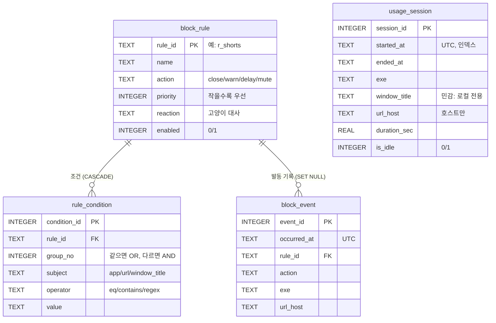

> 고양이 앱 DB는 테이블 4개. **규칙 2개**(block_rule, rule_condition) + **기록 2개**(usage_session, block_event). 핵심은 `group_no`로 AND/OR를 표현하는 조건 테이블.

- 코드: `cat_app.py`의 `SCHEMA` · DB 파일: `%LOCALAPPDATA%\cat-app\cat.db` (개인정보라 OneDrive·git 밖 PC 로컬에 둠)
- 관련: [[진행도]] · [[고양이-생산성-앱-프로젝트]] · [[프로젝트 일정]]
- 작성: 2026-09-26 (11/15 마감 "ERD 완성"의 초안)

## ERD



- `block_rule` 1 : N `rule_condition`: 규칙 하나에 조건 여러 개
- `block_rule` 1 : N `block_event`: 규칙 하나가 여러 번 발동
- `usage_session`: 독립 로그 (관계 없음)

## 테이블별 설계 이유

### block_rule: 어떤 규칙이 있나
| 컬럼 | 이유 |
|---|---|
| `rule_id` TEXT PK | 숫자 대신 `r_shorts` 같은 이름 → 로그만 봐도 어떤 규칙인지 알 수 있음 |
| `action` CHECK | 4개 값만 허용. 오타가 저장되는 것을 DB가 막음 |
| `priority` | 여러 규칙이 동시에 맞으면 작은 숫자가 이김 (쇼츠: close 10 > warn 50) |
| `enabled` | 지우지 않고 끄기만 함 → 과거 block_event가 어떤 규칙이었는지 유지 |

### rule_condition: 언제 발동하나 ⭐
**같은 `group_no` = OR, 다른 `group_no` = AND** → 테이블 하나로 "(A 또는 B) 그리고 (C 또는 D)"를 표현한다.

| 규칙 | group 0 | group 1 | 의미 |
|---|---|---|---|
| r_reels | url⊃instagram.com/reels · url⊃tiktok.com · url⊃youtube.com/shorts | - | 셋 중 하나 |
| r_yt_warn | app = chrome.exe | url⊃youtube.com | 크롬 **이면서** 유튜브 |

`ON DELETE CASCADE`: 규칙을 지우면 조건도 함께 삭제된다 (주인 없는 조건 방지).

### usage_session: 어떤 창을 얼마나 봤나
창이 바뀔 때마다 한 줄씩 기록한다.

| 컬럼 | 이유 |
|---|---|
| `started_at` UTC | 저장은 UTC, 조회 시 `date(started_at, 'localtime')` → 시간대 혼동 방지 |
| `url_host` | 전체 URL 대신 `youtube.com`만 남김 (개인정보 최소화) |
| `window_title` | 문서 이름 등 민감 정보가 있을 수 있어 로컬 전용 |
| `is_idle` | 자리 비움 시간. 통계에서 제외 |
| 인덱스 `ix_session_started` | "오늘 기록" 조회가 잦고 로그가 계속 쌓이므로 |

### block_event: 고양이가 언제 막았나
`ON DELETE SET NULL`: 규칙을 지워도 기록은 남고 `rule_id`만 비워진다 (과거 기록 보존).

## 주요 쿼리

```sql
-- 오늘 가장 많이 쓴 앱 TOP 5 (자리 비움 제외)
SELECT exe, SUM(duration_sec) AS total
FROM usage_session
WHERE is_idle = 0 AND date(started_at, 'localtime') = date('now', 'localtime')
GROUP BY exe ORDER BY total DESC LIMIT 5;

-- 오늘 막은 횟수
SELECT COUNT(*) FROM block_event
WHERE date(occurred_at, 'localtime') = date('now', 'localtime');
```

`load_rules()`는 두 테이블을 파이썬 dict로 묶어 `Rule` 객체를 만든다. SQL로 하면 JOIN이다 (11/9 SQLD 실습 과제):

```sql
SELECT r.rule_id, r.name, c.group_no, c.subject, c.operator, c.value
FROM block_rule r JOIN rule_condition c ON c.rule_id = r.rule_id
WHERE r.enabled = 1;
```

## 일부러 안 한 것

| 안 한 것 | 이유 | 필요해지는 때 |
|---|---|---|
| `app` 테이블 분리 | exe 문자열 반복 저장 (의도적 반정규화). 앱 이름은 안 바뀜 | 앱별 아이콘·카테고리(업무/여가)를 붙일 때 |
| 사용자 테이블 | 1 PC 1 사용자 | 다중 사용자 |
| 시간 조건 (업무시간만 차단) | 스파이크에서 보류 | `subject`에 `'time'` 추가 |
| 실행 중 규칙 갱신 | 규칙은 앱 시작 시 한 번 읽음 | 11/29 규칙 CRUD 구현 때 |

## SQLD 연결
| SQLD 개념 | 이 설계에서 | 공부일 |
|---|---|---|
| 엔터티·속성 | 테이블 4개와 컬럼 | [[2026-11-03]] |
| 관계 | 1:N 두 개 | [[2026-11-03]] |
| 식별자 | `rule_id` = 본질식별자, `session_id` = 인조식별자 | [[2026-11-04]] |
| 정규화 | 규칙/조건 분리 | [[2026-11-05]] |
| 반정규화 | `exe` 미분리 | [[2026-11-06]] |
| 트랜잭션 | `with db:` → 규칙+조건 저장이 전부 되거나 전부 취소 | [[2026-11-06]] |
| JOIN | `load_rules()`를 JOIN으로 바꿔보기 | [[2026-11-09]] |

## 전체 스키마 (cat_app.py 원본)

```sql
PRAGMA foreign_keys = ON;

CREATE TABLE IF NOT EXISTS block_rule (
    rule_id   TEXT PRIMARY KEY,
    name      TEXT NOT NULL,
    action    TEXT NOT NULL CHECK (action IN ('close', 'warn', 'delay', 'mute')),
    priority  INTEGER NOT NULL DEFAULT 100,
    reaction  TEXT NOT NULL DEFAULT '',
    enabled   INTEGER NOT NULL DEFAULT 1 CHECK (enabled IN (0, 1))
);

CREATE TABLE IF NOT EXISTS rule_condition (
    condition_id INTEGER PRIMARY KEY,
    rule_id      TEXT NOT NULL REFERENCES block_rule(rule_id) ON DELETE CASCADE,
    group_no     INTEGER NOT NULL DEFAULT 0,
    subject      TEXT NOT NULL CHECK (subject IN ('app', 'url', 'window_title')),
    operator     TEXT NOT NULL CHECK (operator IN ('eq', 'contains', 'regex')),
    value        TEXT NOT NULL
);

CREATE TABLE IF NOT EXISTS usage_session (
    session_id   INTEGER PRIMARY KEY,
    started_at   TEXT NOT NULL,
    ended_at     TEXT,
    exe          TEXT NOT NULL,
    window_title TEXT,
    url_host     TEXT,
    duration_sec REAL NOT NULL,
    is_idle      INTEGER NOT NULL CHECK (is_idle IN (0, 1))
);
CREATE INDEX IF NOT EXISTS ix_session_started ON usage_session(started_at);

CREATE TABLE IF NOT EXISTS block_event (
    event_id    INTEGER PRIMARY KEY,
    occurred_at TEXT NOT NULL,
    rule_id     TEXT REFERENCES block_rule(rule_id) ON DELETE SET NULL,
    action      TEXT NOT NULL,
    exe         TEXT,
    url_host    TEXT
);
```
