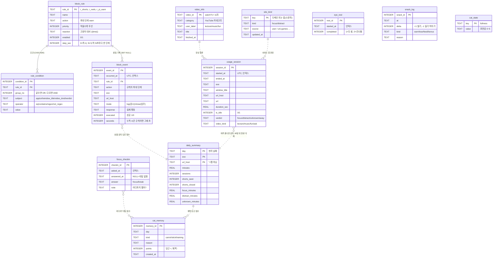

> 고양이 앱 DB는 테이블 12개 (스키마 v11). 정리된 ERD는 위키 [[고양이-앱-db-erd]]. 이 문서는 설계 이유와 변경 이력. **원본 기록 2개는 90일 보관**, **고양이 기억 2개(하루 요약, 채찍·당근·훈련)는 영구 보관**. **규칙 2개**(block_rule, rule_condition) + **기록 2개**(usage_session, block_event). 핵심은 `group_no`로 AND/OR를 표현하는 조건 테이블.

- 코드: `cat_app.py`의 `SCHEMA` · DB 파일: `%LOCALAPPDATA%\cat-app\cat.db` (개인정보라 OneDrive·git 밖 PC 로컬에 둠)
- 관련: [[진행도]] · [[고양이-생산성-앱-프로젝트]] · [[프로젝트 일정]]
- 작성: 2026-09-26 (11/15 마감 "ERD 완성"의 초안)

## ERD



- 실선 = 외래키 관계 (`block_rule` 1:N `rule_condition`, `block_rule` 1:N `block_event`), 점선 = 값으로 이어지는 흐름 (요약·판정·점수)
- v9에서 `focus_task`·`allow_item`, `usage_session.task_id`, `block_rule.min_minutes`, `block_event.minutes` 제거 — 아래 v5·v7 설명에 나오는 것은 당시 기록

## 테이블별 설계 이유

### block_rule: 어떤 규칙이 있나
| 컬럼 | 이유 |
|---|---|
| `rule_id` TEXT PK | 숫자 대신 `r_shorts` 같은 이름 → 로그만 봐도 어떤 규칙인지 알 수 있음 |
| `action` CHECK | 4개 값만 허용. 오타가 저장되는 것을 DB가 막음 |
| `priority` | 여러 규칙이 동시에 맞으면 작은 숫자가 이김 (쇼츠: close 10 > warn 50) |
| `enabled` | 지우지 않고 끄기만 함 → 과거 block_event가 어떤 규칙이었는지 유지 |
| `min_minutes` (v1) | 0이면 창을 열자마자, N이면 **오늘 그 사이트/앱 누적 N분마다** 발동. `reaction`의 `{minutes}`에 누적 분이 들어감 → "유튜브 5분째야", "유튜브 10분째야" (v2부터 5분 단위) |

### rule_condition: 언제 발동하나 ⭐
**같은 `group_no` = OR, 다른 `group_no` = AND** → 테이블 하나로 "(A 또는 B) 그리고 (C 또는 D)"를 표현한다.

| 규칙 | group 0 | group 1 | 의미 |
|---|---|---|---|
| r_reels | url⊃instagram.com/reels · url⊃tiktok.com · url⊃youtube.com/shorts | - | 셋 중 하나 |
| r_yt_warn | app = chrome.exe | url⊃youtube.com | 크롬 **이면서** 유튜브 |

`ON DELETE CASCADE`: 규칙을 지우면 조건도 함께 삭제된다 (주인 없는 조건 방지).

### usage_session: 어떤 창을 얼마나 봤나
**앱이 바뀌거나 (브라우저는) 주소가 바뀔 때** 한 줄씩 기록한다. 창 제목만 바뀌는 건(터미널 스피너, 알림 개수) 같은 세션이다. **1초 이하 세션은 저장하지 않는다.**

| 컬럼 | 이유 |
|---|---|
| `started_at` UTC | 저장은 UTC, 조회 시 `date(started_at, 'localtime')` → 시간대 혼동 방지 |
| `url_host` | `youtube.com`처럼 사이트 단위 집계용 (누적 분 계산도 이걸로) |
| `url` (v1) | 전체 주소. 쇼츠인지 강의인지 구분 → **당근/채찍 판단 재료**. 로컬 전용 |
| `window_title` | 영상·문서 제목. 당근/채찍 판단 재료. 로컬 전용 |
| `is_idle` | 자리 비움 시간. 통계에서 제외 |
| 인덱스 `ix_session_started` | "오늘 기록" 조회가 잦고 로그가 계속 쌓이므로 |

### block_event: 고양이가 언제 막았나
`ON DELETE SET NULL`: 규칙을 지워도 기록은 남고 `rule_id`만 비워진다 (과거 기록 보존).

| 컬럼 (v1) | 이유 |
|---|---|
| `mode` | 그때 모드. 감시 모드에서 쇼츠를 본 것과 업무모드에서 고양이가 막은 것은 의미가 다르다 |
| `executed` | 실제로 닫았는지. 업무모드여도 그 사이 창이 바뀌면 안 닫는다. v0 기록은 NULL(알 수 없음) |
| `minutes` | "N분째야" 경고가 몇 분 시점에 나왔는지 |

## 스키마 버전 관리 (마이그레이션)
- DB 파일 안의 `PRAGMA user_version`에 **몇 번째 변경까지 적용됐는지** 저장한다.
- 앱이 켜질 때 `MIGRATIONS` 목록 중 아직 안 된 것만 순서대로 적용 (`migrate()`). 하나의 변경은 한 트랜잭션이라 중간에 실패하면 통째로 취소.
- 규칙: **이미 배포된 변경은 고치지 않고, 새 변경은 맨 뒤에 추가만** 한다.

| 버전 | 내용 |
|---|---|
| v0 | 테이블 4개 (최초) |
| v11 (2026-09-27) | `snack_log`, `cat_state` 추가 · 기분을 포만감 기준으로 · 움직이는 고양이 |
| v10 (2026-09-27) | `eye_rest` 추가 (20-20-20 눈 쉬기 기록) · 고양이 기분별 딴짓 간격(코드) · 백업 자동 회전 확인 (`v8`, `v9`) |
| v9 (2026-09-27) | 정리: 딴짓 단계 10초(테스트 값) → **5분** · `focus_task`·`allow_item` 삭제 · `usage_session`·`focus_checkin`에서 `task_id` 제거(FK라 재생성) · `min_minutes`·`block_event.minutes` DROP · `video_info.title` 추가 · `focus_checkin` 인덱스 · **업그레이드 전 자동 백업**(최근 2개) · 채찍·당근 점수(`score_day`) · UT1 30일마다 갱신 |
| v8 (2026-09-27) | `site_kind` 추가(내 대답 + UT1 공개 목록) · 딴짓 규칙을 `verdict = 'distract'`로 일반화 · `rule_condition.subject`에 `verdict` · 백업 `cat.backup-v7.db` |
| v7 (2026-09-27) | 단계 간격 분 → 초: `block_rule.step_sec` 추가 (딴짓 영상 **10초마다**), `block_event.seconds` 추가 · 업무모드 쇼츠는 첫 번째부터 바로 닫기(코드) · 단계는 한 번에 한 칸씩(오늘 몇 번째 반응인가) · 백업 `cat.backup-v6.db` |
| v6 (2026-09-26) | `video_info` 추가 · `usage_session.video_kind` · `rule_condition.subject`에 `video_kind` 추가 (CHECK 변경이라 재생성) · 유튜브 규칙이 제목 대신 영상 종류를 봄 · 백업 `cat.backup-v5.db` |
| v5 (2026-09-26) | `focus_task`, `allow_item`, `focus_checkin` 추가 · `usage_session.verdict/task_id` · `daily_summary` 집중·딴짓·모름 분 · 백업 `cat.backup-v4.db` |
| v4 (2026-09-26) | 반응 단계 도입: `block_rule.action`은 **최대 단계**, `block_event.response`에 실제 행동 기록 · `rule_condition.operator`에 `not_regex` 추가 (CHECK 변경이라 테이블 재생성) · 유튜브 규칙에 "공부·음악 제목 제외" 조건 · 백업 `cat.backup-v3.db` |
| v3 (2026-09-26) | `daily_summary`, `cat_memory` 테이블 추가 · `block_event.occurred_at` 인덱스 · 원본 90일 보관 정책 (`RETENTION_DAYS`) |
| v2 (2026-09-26) | 유튜브 경고 기준 30분 → **5분마다** (값이 30인 경우만 변경) |
| v1 (2026-09-26) | `usage_session.url`, `block_event.mode/executed/minutes`, `block_rule.min_minutes` 추가 · 경고 규칙을 "누적 30분마다"로 변경 · 1초 이하 세션 삭제 (실제 DB: 698건 → 241건, 백업 `cat.backup-2026-09-26.db`) |

### daily_summary · cat_memory: 고양이의 영구 기억 (v3)
| 구분 | 테이블 | 보관 | 이유 |
|---|---|---|---|
| 원본 | `usage_session`, `block_event` | **90일** | 1초 단위 상세 기록. 하루 수백 건 → 계속 두면 커짐 |
| 기억 | `daily_summary` | 영구 | 하루 20줄 안팎 → 10년 쌓여도 몇 MB. 훈련(평소 기준) 계산 재료 |
| 기억 | `cat_memory` | 영구 | 🥕 당근 / 🪓 채찍 / 🧠 훈련 기록. `kind`는 CHECK로 3가지만 허용 |

`summarize_and_prune()` (앱이 켜질 때마다):
1. 어제까지 중 **아직 요약 안 된 날**을 `daily_summary`로 요약 (오늘은 아직 안 끝났으니 제외)
2. **요약이 끝난 날** 중 90일 넘은 원본만 삭제
3. ①②가 한 트랜잭션 → 요약이 실패하면 삭제도 안 일어남. 여러 번 실행해도 결과 동일

`url_host`에 NULL 대신 `''`를 쓰는 이유: 기본키(PK) 컬럼은 NULL이면 중복 판정이 안 된다.

**훈련 기억 아이디어:** `daily_summary`로 최근 7일 평균 유튜브 분을 계산 → 오늘이 평균보다 적으면 🥕, 많으면 🪓 → 결과를 `cat_memory`에 남김. (점수 규칙은 추후 결정)

## 간식과 포만감 (v11)
- `snack_log` — 간식 변화 기록, **간식 수 = SUM(delta)**. earn(딴짓 없이 20분) · lose(딴짓 반응마다, 0 밑으로 안 감) · feed(먹이기) · bonus(첫 만남 2개, 점수 +10 이상인 날 5점마다 1개·최대 3)
- `cat_state('fullness')` — 포만감 0~5. 먹이면 +1, 앱이 켜져 있는 1시간마다 -1
- **기분 = 포만감** (v10의 '전날 점수' 기분을 대체): 3~5 😺 ×2 · 1~2 🐱 ×1 · 0 😾 ×0.5. 딴짓 단계를 판정할 때마다 그 순간 기분으로 간격을 계산 → 간식을 먹이면 바로 적용. 단계 기억 키는 '구간 번호'가 아니라 '구간 경계 초'라서 간격이 바뀌어도 한 번에 한 칸씩
- 움직이는 고양이(`cat_sprite.py`)는 DB가 아니라 화면 쪽: 루프가 `ctl.anims`에 (자세, 초)를 넣으면 고양이가 그 동작을 한다

## 눈 쉬기와 고양이 기분 (v10)
- **👀 20-20-20** — 루프가 화면을 본 시간을 세다가 20분이 되면 창에 눈 쉬기를 요청. 입력이 20초 넘게 없으면 이미 쉰 것으로 보고 0부터. 창이 `eye_rest`에 시작을 기록하고, 20초를 다 채우면 `completed = 1`, Esc면 0. 원본처럼 90일 보관. 점수: 모두 지키면 🥕+2, 건너뛴 만큼 🪓-1(최대 -3)
- **😺 기분 (`cat_mood`)** — 최근 점수를 매긴 날의 `cat_memory` 합계: +10 이상 😺(딴짓 간격 ×2), -4~+9 🐱(×1), -5 이하 😾(×0.5). 루프가 시작할 때 딴짓 규칙의 `step_sec`에 곱한다 (DB 값은 그대로, 그날 실행에만 적용). 스키마 변경 없음

## 채찍·당근과 배운 것 (v9)
- **점수 (`score_day`)** — 하루가 요약될 때(다음 날 처음 켤 때) 그날 점수를 `cat_memory`에 쓴다. 시작용 기본값:
  | | 조건 | 점수 |
  |---|---|---|
  | 🥕 | 집중 30분 이상 / 평소보다 더 집중 / 숏폼 0회 / "어디야?" 모두 대답 | +5 / +5 / +3 / +2 |
  | 🪓 | 딴짓 30분 이상 / 평소보다 딴짓 20%↑(10분 이상) / 숏폼 1회당 / "어디야?" 무응답 1회당 | -5 / -5 / -2(최대 -10) / -1 |
  | 🧠 | 평소 = 최근 7일 평균 집중·딴짓 분 | 0 |
- **배운 것 (`learned`, `forget`)** — 고양이 창 "🧠 배운 것"에서 내 대답(사이트·영상)을 보고 지운다 → 다음에 다시 물어봄
- **오늘 한 일** — 판정별 무엇을 했나 + "어디야?" 대답과 메모 + 최근 채찍·당근

## 인터넷 전체 자동 분류 (v8)
`classify()` 판정 순서: 쇼츠 규칙 → 유튜브 영상 종류 → 이번 실행 대답 → **③ `site_kind`(source='user')** → **④ `PATH_RULES`** → **② 내장 목록** → **① `site_kind`(source='ut1:…')** → 제목 키워드 → 모름

| 층 | 저장 위치 | 내용 |
|---|---|---|
| ① 공개 목록 | `site_kind` (ut1:분류) | UT1 딴짓 8개 분류 약 12.5만 도메인. 처음 켤 때 뒤에서 받음, `--update-sites`로 갱신. **user 행은 덮어쓰지 않음** (`ON CONFLICT … WHERE source != 'user'`) |
| ② 내장 목록 | 코드 (`FOCUS_*`, `DISTRACT_*`) | UT1에 빈 곳이 많은 한국 사이트 보강 |
| ③ 내 대답 | `site_kind` (user) | "응, 기억해" → focus, "아니, 딴짓" → distract. 둘 다 영구 (v8 전에는 딴짓 대답은 메모리에만) |
| ④ 경로 규칙 | 코드 (`PATH_RULES`) | 유튜브 홈·채널·구독·재생목록 페이지 → distract. 호스트는 정확히 일치 (music.youtube.com 제외) |

- 도메인은 가장 구체적인 것부터 찾는다 (`play.game.com` → `game.com`).
- 딴짓 규칙(`r_yt_warn`, 이름 '딴짓 (영상·사이트)')의 조건이 `verdict = 'distract'` 하나로 바뀜 → **판정이 딴짓인 모든 창**에 10초 단계. 크롬 전용 조건도 사라짐. `rule_condition.subject`에 `verdict` 추가 (CHECK 변경이라 재생성)
- `allow_item`/`focus_task`는 더 쓰지 않음 (배운 앱·사이트는 v8에서 `site_kind`로 옮김)

## 유튜브 영상 종류 (v6)
`video_kind` = **사용자 대답 > YouTube 카테고리 > 제목 키워드** 순서로 정한다 (`video_kind()`).
- 카테고리는 영상 페이지의 `"category":"…"`를 한 번 읽어 `video_info`에 캐시 (API 키 없음, 영상당 1회, 감시가 멈추지 않게 별도 스레드)
- Music → `music`, Education/Science & Technology/Howto & Style → `lecture`, Gaming/Comedy/Sports… → `fun`, 그 밖·못 읽음 → `ask`
- `ask`: 업무모드는 10초 뒤 "이거 강의 맞아?" → `video_info.user_label`에 저장 + `cat_memory` 훈련 기록. 감시 모드는 `fun`으로 봄
- 유튜브 딴짓 규칙(`r_yt_warn`)의 3번째 조건이 제목 키워드에서 `video_kind not_regex ^(lecture|music|ask)$`로 바뀜 → 딴짓 영상만 걸림. 아직 카테고리를 가져오는 중(NULL)이면 걸리지 않음
- 실측: HATENA는 업로더가 `People & Blogs`로 올려서 `ask` → 한 번 대답하면 이후 노래로 기억

## 업무·공부 판정 (v5 → 2026-09-27 자동 분류로 변경)
> **변경:** 시작할 때 "오늘 뭐 할 거야?"로 할 일과 허용 목록을 고르던 방식을 없애고 **자동 분류**로 바꿨다. 스키마는 그대로 — `focus_task`에는 `'자동 분류'` 한 줄만 쓰고, 고양이가 "이것도 공부야?"로 배운 앱·사이트가 그 `allow_item`에 쌓인다 (`learned = 1`). 재생목록·키워드 허용은 쓰지 않는다 (영상은 카테고리로 분류).
>
> 판정 순서: 차단 규칙 → 영상 종류(강의·노래) → 이번 실행 대답 → 배운 목록 → **내장 목록**(`FOCUS_APPS/HOSTS`, `DISTRACT_APPS/HOSTS`) → 제목 키워드 → 모름

(아래는 v5 당시 설계 기록)
**"공부 중"** = 맨 앞 창이 그 할 일의 **허용 목록**에 있고, 20분마다 묻는 **"어디야?"에 대답**하는 상태.

| 판정 (`usage_session.verdict`) | 조건 (위에서부터 먼저) |
|---|---|
| 😼 `distract` | 차단 규칙(쇼츠·오락 유튜브)에 걸림 |
| 사용자가 이번 실행에서 답함 | "이번만" → focus, "아니, 딴짓" → distract |
| 📚 `focus` | 허용 목록에 있음 (앱 / 사이트 / 재생목록 `list=` / 제목 키워드), 또는 브라우저 제목에 강의·음악 단어 (보조) |
| ❓ `unknown` | 그 밖 → 업무모드에서 30초 넘으면 "이것도 공부야?" |
| 💤 `away` | "어디야?"에 3분 넘게 대답 없음, 또는 입력 없고 공부 창도 아님 |

- **재생목록이 핵심**: 유튜브 재생목록에서 다음 영상으로 넘어가면 `v=`만 바뀌고 `&list=`는 그대로라서, 재생목록을 한 번 등록하면 강의·음악이 이어져도 계속 허용된다.
- 공부 창에서는 키보드·마우스 입력이 없어도 자리 비움으로 보지 않는다 (강의 시청). 대신 20분 확인으로 판단한다.
- "응, 기억해" → `allow_item.learned = 1` + `cat_memory`에 `training` 기록 → 쓸수록 덜 묻는다.
- `daily_summary`에 `focus_minutes / distract_minutes / unknown_minutes` 추가 → 채찍·당근 점수 재료.

## 고양이 반응 단계 (v4, v7에서 변경)
> **v7:** 업무모드의 즉시 규칙(`step_sec = 0`, 쇼츠·릴스)은 바로 최대 단계(닫기). 시간 규칙은 `min_minutes` 대신 `step_sec`(초) 단위, 딴짓 영상 10초. 단계(level)는 '오늘 이 규칙의 몇 번째 반응인가'라서 한 칸씩만 오른다. 아래 표는 v4 당시 기록.

`LADDER = warn → mute → delay → close`. 규칙의 `action`은 "여기까지 올라갈 수 있다"는 **최대 단계**다.

| | 쇼츠·릴스 (`min_minutes = 0`) | 유튜브 (`min_minutes = 5`) |
|---|---|---|
| 단계(level) | 오늘 이 규칙 발동 횟수 (`block_event` COUNT) | 오늘 누적 분 ÷ 5 − 1 |
| 누적 분 계산 | 저장된 제목·주소를 **규칙에 다시 대 봐서** 걸리는 세션만 합산 → 공부 영상 시간은 빠짐 | 같음 |

- 업무모드: `LADDER[min(level, 최대 단계)]`
- 감시 모드: 말하기만. 단, 오늘 누적 60분 이상이면 소리 끄기
- 소리를 끈 뒤 규칙에 안 걸리는 창으로 옮기거나 앱이 끝나면 다시 켠다
- 유튜브 제외 조건: `window_title not_regex "강의|수업|공부|…|노래|음악|lofi|플레이리스트"` (`watch.py`의 `STUDY_WORDS`)
- 숏폼 집계(`daily_summary.shorts_seen`, 리포트)는 **즉시 판정 규칙(`min_minutes = 0`)의 발동만** 센다 → 유튜브 N분 알림은 섞이지 않는다
- 단계·횟수 계산은 `response IS NOT NULL`(v4 이후 기록)만 센다. 옛 기록까지 세면 첫 쇼츠부터 바로 닫는 버그가 있었다 (2026-09-26 수정)

## 주요 쿼리

```sql
-- 오늘 가장 많이 쓴 앱 TOP 5 (자리 비움 제외)
SELECT exe, SUM(duration_sec) AS total
FROM usage_session
WHERE is_idle = 0 AND date(started_at, 'localtime') = date('now', 'localtime')
GROUP BY exe ORDER BY total DESC LIMIT 5;

-- 오늘 막은 횟수
SELECT COUNT(*) FROM block_event
WHERE date(occurred_at, 'localtime') = date('now', 'localtime');
```

`load_rules()`는 두 테이블을 파이썬 dict로 묶어 `Rule` 객체를 만든다. SQL로 하면 JOIN이다 (11/9 SQLD 실습 과제):

```sql
SELECT r.rule_id, r.name, c.group_no, c.subject, c.operator, c.value
FROM block_rule r JOIN rule_condition c ON c.rule_id = r.rule_id
WHERE r.enabled = 1;
```

## 일부러 안 한 것

| 안 한 것 | 이유 | 필요해지는 때 |
|---|---|---|
| `app` 테이블 분리 | exe 문자열 반복 저장 (의도적 반정규화). 앱 이름은 안 바뀜 | 앱별 아이콘·카테고리(업무/여가)를 붙일 때 |
| 사용자 테이블 | 1 PC 1 사용자 | 다중 사용자 |
| 채찍·당근 점수 규칙 | 기억 테이블만 먼저 만듦 (v3) | 당근/채찍 기능 구현 때 |
| 공부 판별 고도화 | 지금은 제목 키워드만 봄 | 채널 목록, 시청 패턴으로 판별할 때 |
| 시간대 조건 (업무시간만 차단) | 스파이크에서 보류. 누적 시간 조건은 v1에서 `min_minutes`로 해결 | `subject`에 `'time'` 추가 |
| 실행 중 규칙 갱신 | 규칙은 앱 시작 시 한 번 읽음 | 11/29 규칙 CRUD 구현 때 |

## SQLD 연결
| SQLD 개념 | 이 설계에서 | 공부일 |
|---|---|---|
| 엔터티·속성 | 테이블 4개와 컬럼 | [[2026-11-03]] |
| 관계 | 1:N 두 개 | [[2026-11-03]] |
| 식별자 | `rule_id` = 본질식별자, `session_id` = 인조식별자 | [[2026-11-04]] |
| 정규화 | 규칙/조건 분리 | [[2026-11-05]] |
| 반정규화 | `exe` 미분리 | [[2026-11-06]] |
| 트랜잭션 | `with db:` → 규칙+조건 저장이 전부 되거나 전부 취소 | [[2026-11-06]] |
| JOIN | `load_rules()`를 JOIN으로 바꿔보기 | [[2026-11-09]] |

## 전체 스키마 (cat_app.py 원본)

아래는 v0 테이블 정의(`SCHEMA`)다. v1 컬럼은 위 마이그레이션 표와 `cat_app.py`의 `MIGRATIONS` 참고.

```sql
PRAGMA foreign_keys = ON;

CREATE TABLE IF NOT EXISTS block_rule (
    rule_id   TEXT PRIMARY KEY,
    name      TEXT NOT NULL,
    action    TEXT NOT NULL CHECK (action IN ('close', 'warn', 'delay', 'mute')),
    priority  INTEGER NOT NULL DEFAULT 100,
    reaction  TEXT NOT NULL DEFAULT '',
    enabled   INTEGER NOT NULL DEFAULT 1 CHECK (enabled IN (0, 1))
);

CREATE TABLE IF NOT EXISTS rule_condition (
    condition_id INTEGER PRIMARY KEY,
    rule_id      TEXT NOT NULL REFERENCES block_rule(rule_id) ON DELETE CASCADE,
    group_no     INTEGER NOT NULL DEFAULT 0,
    subject      TEXT NOT NULL CHECK (subject IN ('app', 'url', 'window_title')),
    operator     TEXT NOT NULL CHECK (operator IN ('eq', 'contains', 'regex')),
    value        TEXT NOT NULL
);

CREATE TABLE IF NOT EXISTS usage_session (
    session_id   INTEGER PRIMARY KEY,
    started_at   TEXT NOT NULL,
    ended_at     TEXT,
    exe          TEXT NOT NULL,
    window_title TEXT,
    url_host     TEXT,
    duration_sec REAL NOT NULL,
    is_idle      INTEGER NOT NULL CHECK (is_idle IN (0, 1))
);
CREATE INDEX IF NOT EXISTS ix_session_started ON usage_session(started_at);

CREATE TABLE IF NOT EXISTS block_event (
    event_id    INTEGER PRIMARY KEY,
    occurred_at TEXT NOT NULL,
    rule_id     TEXT REFERENCES block_rule(rule_id) ON DELETE SET NULL,
    action      TEXT NOT NULL,
    exe         TEXT,
    url_host    TEXT
);
```
